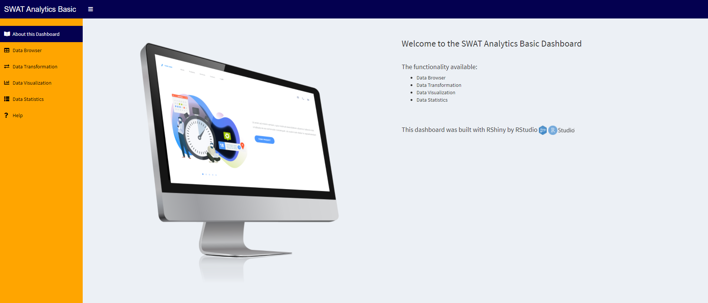

# SWAT-Analytic-Basic

[Swat Analytic Basic](https://mackykavinsky.shinyapps.io/swat-analytic-basic/)

###This project was collaborated in our team of 3 people.

Where i am handling with the framework of the application, data browser module and assisting in data statistics. 

---

This dashboard is created based on user request where user may have or may not have statistical background in handling dataset. This application will be hosted on client's side server.

The functionality available using this application is:

1. Data Browser
2. Data Transformation
3. Data Visualization
4. Data Statistics

---

1. Data Browser (My responsibility)

This module is for importing data module. User can check their dataset through Data Browse tabs.

For the specific data type for each column at Data Structure.

---

2. Data Transformation (Syahida)

This module has 3 operation that could be applied on the dataset, which are rename column, select, and change datatype. This option were based on user request/requirements.

---

3. Data Visualization (Kelly)

This module is where the user could visualize their dataset. There are few graph could be chosen which are, graph, heatmap, line, scatter and area. This is also based on user requirements.

---

4. Data Statistics (Assisting)

This module allow user to select specific categorical value in categorical column and run through statistical method based on chosen numerical column. (Sounds complicated right? You could try this at the link given above)

---

Thanks to the Syahida & Kelly that helped to finish their part of module. It was great working together with you guys.
